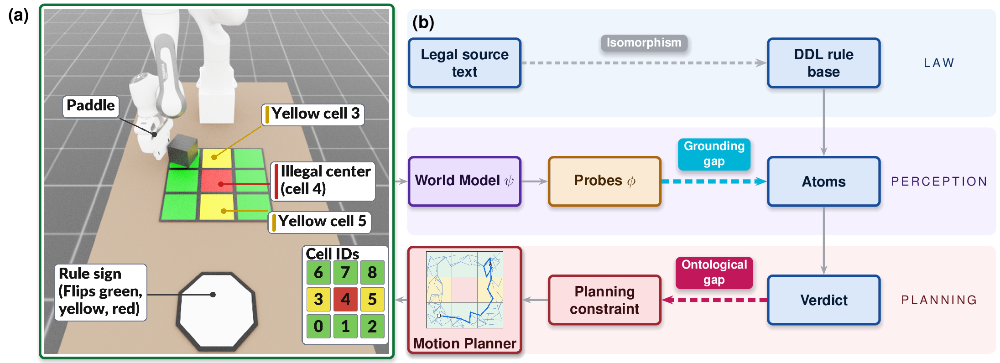

# Legislated Planner

<p align="center">
  <a href="https://arxiv.org/abs/2609.15113"></a>
  <a href="https://dylanwaldner-cail.github.io/Legislated-Planner/"></a>
  <!-- BLOG: drop the URL in and uncomment when the post is live.
  <a href="BLOG_URL_HERE"></a>
  -->
</p>

<p align="center">
  
</p>

<p align="center">
  <sub><b>The legislation planning stack.</b> A DDL rule base encodes the legal source text, learned
  probes ground its facts from world-model latents, and the verdict constrains the RRT planner.
  Dashed arrows are the two isomorphism gaps.</sub>
</p>

Research code for **law as control**: human-authored legal norms, written in Defeasible Deontic
Logic (DDL), are compiled into constraints on a world-model-based robot motion planner. A learned
probe reads facts off a frozen-DINO world model, a clingo-backed DDL reasoner turns those facts and
the lawset into obligations, prohibitions and permissions, and the verdicts prune the planner's
search *before* an illegal action is executed.

The same scenario yields a **social** agent (obeys — detours around a forbidden cell), a **deviant**
agent (prices violations — breaks the law only when the detour costs more), or a **realistic** agent
(ignores the law) purely by switching the enforcement mode.

The task is single-arm cube-pushing across a 3×3 grid in IsaacLab.

## Layout

Everything lives under [`src/`](src/):

| path | what |
|---|---|
| [`src/README.md`](src/README.md) | **start here** — setup, dependencies, pipeline, full file map |
| `src/legislation/` | the DDL layer: `legal_database.yaml` (the only place laws are defined), reasoner, grounding, constraint |
| `src/planning/` | planners (RRT, CEM, MPC) and the objectives they optimize |
| `src/probes/` | learned readouts from world-model latents (cube position, cell occupancy, sign color) |
| `src/env/` | the IsaacLab cube-pushing environment and grid metadata |
| `src/Defeasible-Deontic-Logic/` | the DDL-in-ASP solver the reasoner calls |
| `src/DINOREADME.md` | upstream DINO-WM world-model training and dataset docs |

## Requirements

Two dependencies are **not** vendored here and must be obtained separately.

**1. The DDL engine.** The defeasible deontic logic solver (ASP/clingo) is a separate upstream
project by Guido Governatori. Clone it and point the reasoner at it:

```bash
git clone https://github.com/gvdgdo/Defeasible-Deontic-Logic.git
export DDL_ROOT=$PWD/Defeasible-Deontic-Logic
```

Without `DDL_ROOT`, `src/legislation/reasoner.py` falls back to `src/Defeasible-Deontic-Logic/`.
This work was built against commit `679c638`; the engine's inference semantics determine every
deontic verdict, so check that commit out if you are reproducing published results.

**2. IsaacLab / Isaac Sim**, a hard dependency for every rollout.

Python packages (`clingo` included) are pinned in
[`src/requirements.txt`](src/requirements.txt). Full instructions, version pins and
known traps are in [`src/README.md`](src/README.md).

## Third-party code

The Academic Public License in [LICENSE](LICENSE) covers the original work in this repository. The
following vendored directories are third-party and remain under their own terms:

| path | origin | license |
|---|---|---|
| `src/env/deformable_env/`, `pointmaze/`, `pusht/`, `wall/` | DINO-WM | MIT — see [`src/LICENSE`](src/LICENSE) |
| `src/models/encoder/r3m/` | R3M (Meta) | MIT |
| `src/metrics/lpipsPyTorch/` | LPIPS PyTorch | MIT |

## Paper

*Legislating World-Model-Based Planning with Legal Reasoning.* Dylan Waldner, Yiannis Kantaros,
Guido Governatori, Risto Miikkulainen, Amir Banifatemi.
[arXiv:2609.15113](https://arxiv.org/abs/2609.15113) ([PDF](https://arxiv.org/pdf/2609.15113)) ·
[project page](https://dylanwaldner-cail.github.io/Legislated-Planner/)

```bibtex
@article{waldner2026legislating,
  title   = {Legislating World-Model-Based Planning with Legal Reasoning},
  author  = {Waldner, Dylan and Kantaros, Yiannis and Governatori, Guido
             and Miikkulainen, Risto and Banifatemi, Amir},
  journal = {arXiv preprint arXiv:2609.15113},
  year    = {2026}
}
```

## License

Academic Public License — free for teaching, academic research and non-profit use. Commercial use
requires a commercial license from Cognizant Technology Solutions Corp. See [LICENSE](LICENSE).
